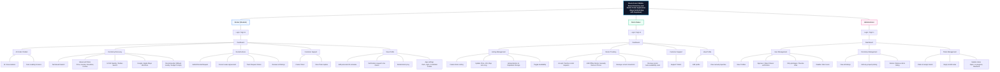

# Room Scout - Functional Decomposition

This document decomposes the features and modules of the **Room Scout** application based on user roles and future plan requirements.

```mermaid
flowchart TD
    %% Main Title
    Title["Room Scout: Mobile-Based Dormitory and Rental Finder Application
    (Expo Android App with Supabase)"]
    style Title fill:#0f172a,stroke:#38bdf8,stroke-width:3px,color:#fff,font-weight:bold;

    %% Roles
    RenterRole["Renter (Student)"]
    OwnerRole["Dorm Owner"]
    AdminRole["Administrator"]

    style RenterRole fill:#eff6ff,stroke:#3b82f6,stroke-width:2px,font-weight:bold;
    style OwnerRole fill:#ecfdf5,stroke:#10b981,stroke-width:2px,font-weight:bold;
    style AdminRole fill:#fdf2f8,stroke:#ec4899,stroke-width:2px,font-weight:bold;

    Title --- RenterRole
    Title --- OwnerRole
    Title --- AdminRole

    %% Renter Branches
    R_Auth[Login / Sign In]
    R_Dash[Dashboard]
    R_AI[AI Finder Chatbot]
    R_DormBrowse[Dormitory Discovery]
    R_RentReq[Rental Actions]
    R_Support[Customer Support]
    R_Profile[View Profile]

    RenterRole --- R_Auth
    R_Auth --- R_Dash
    R_Dash --- R_AI
    R_Dash --- R_DormBrowse
    R_Dash --- R_RentReq
    R_Dash --- R_Support
    R_Dash --- R_Profile

    %% Renter Subfeatures
    R_AI_1[AI Conversations]
    R_AI_2[Cute Loading Screens]
    R_AI --- R_AI_1
    R_AI --- R_AI_2

    R_DB_1[Text-based Search]
    R_DB_2[Advanced Filters <br> Price, Gender, Amenities, Curfew]
    R_DB_3[UCLM Nearby / Radius Search]
    R_DB_4[Google / Apple Maps directions]
    R_DB_5[Recommender fallback <br> nearby / budget if empty]
    R_DormBrowse --- R_DB_1
    R_DormBrowse --- R_DB_2
    R_DormBrowse --- R_DB_3
    R_DormBrowse --- R_DB_4
    R_DormBrowse --- R_DB_5

    R_RR_1[Submit Rental Request]
    R_RR_2[Cancel Lease Agreement]
    R_RR_3[Track Request Status]
    R_RR_4[Reviews & Ratings]
    R_RentReq --- R_RR_1
    R_RentReq --- R_RR_2
    R_RentReq --- R_RR_3
    R_RentReq --- R_RR_4

    R_SP_1[Create Ticket]
    R_SP_2[View Ticket replies]
    R_Support --- R_SP_1
    R_Support --- R_SP_2

    R_PF_1[Edit personal info & Avatar]
    R_PF_2[Verification request to be Owner]
    R_PF_3[Rental History log]
    R_PF_4[App settings <br> Dark, Light, Colorblind modes]
    R_Profile --- R_PF_1
    R_Profile --- R_PF_2
    R_Profile --- R_PF_3
    R_Profile --- R_PF_4


    %% Owner Branches
    O_Auth[Login / Sign In]
    O_Dash[Dashboard]
    O_DormMan[Listing Management]
    O_RentMan[Renter Tracking]
    O_Support[Customer Support]
    O_Profile[View Profile]

    OwnerRole --- O_Auth
    O_Auth --- O_Dash
    O_Dash --- O_DormMan
    O_Dash --- O_RentMan
    O_Dash --- O_Support
    O_Dash --- O_Profile

    %% Owner Subfeatures
    O_DM_1[Create Dorm Listing]
    O_DM_2[Update Price, Info, Map Lat-Long]
    O_DM_3[Upload photos to Supabase Storage]
    O_DM_4[Toggle Availability]
    O_DormMan --- O_DM_1
    O_DormMan --- O_DM_2
    O_DormMan --- O_DM_3
    O_DormMan --- O_DM_4

    O_RM_1[Accept / Decline rental requests]
    O_RM_2[Add Offline Renter manually <br> Name & Phone]
    O_RM_3[Manage current tenants list]
    O_RM_4[Remove renter <br> Auto-availability reset]
    O_RentMan --- O_RM_1
    O_RentMan --- O_RM_2
    O_RentMan --- O_RM_3
    O_RentMan --- O_RM_4

    O_SP_1[Support Tickets]
    O_Support --- O_SP_1

    O_PF_1[Edit profile]
    O_PF_2[View owned properties]
    O_Profile --- O_PF_1
    O_Profile --- O_PF_2


    %% Admin Branches
    A_Auth[Login / Sign In]
    A_Dash[Dashboard]
    A_UserMan[User Management]
    A_ListMan[Dormitory Management]
    A_TickMan[Ticket Management]

    AdminRole --- A_Auth
    A_Auth --- A_Dash
    A_Dash --- A_UserMan
    A_Dash --- A_ListMan
    A_Dash --- A_TickMan

    %% Admin Subfeatures
    A_UM_1[View Profiles]
    A_UM_2[Approve / Reject Owner verification]
    A_UM_3[Strip privileges / Revoke roles]
    A_UM_4[Disable / Ban Users]
    A_UserMan --- A_UM_1
    A_UserMan --- A_UM_2
    A_UserMan --- A_UM_3
    A_UserMan --- A_UM_4

    A_LM_1[View all listings]
    A_LM_2[Edit any property listing]
    A_LM_3[Delete / Remove dorm listing]
    A_ListMan --- A_LM_1
    A_ListMan --- A_LM_2
    A_ListMan --- A_LM_3

    A_TM_1[Claim & Assign tickets]
    A_TM_2[Reply & Add notes]
    A_TM_3[Update status <br> Open, In-progress, Resolved]
    A_TickMan --- A_TM_1
    A_TickMan --- A_TM_2
    A_TickMan --- A_TM_3
```
